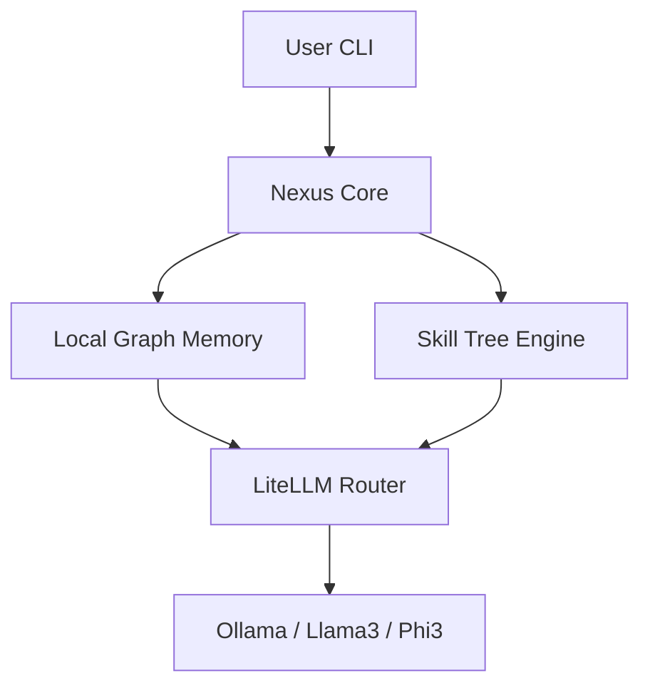

<div align="center">

# 🧠 NexusAgent 
### The Zero-Config, Self-Evolving Local AI Agent Framework

[](https://opensource.org/licenses/MIT)
[](https://www.python.org/downloads/)
[](http://makeapullrequest.com)
[](https://ollama.ai/)
[](https://github.com/BerriAI/litellm)

**[Website](https://your-username.github.io/nexus-agent)** • **[Documentation](docs/)** • **[Discord Community](#)** 

---

NexusAgent is a privacy-first, on-device AI coding agent that lives in your terminal. It understands your codebase, automates tasks, and **writes its own skills** as you use it. 

</div>

## 🌟 Why NexusAgent?

In 2026, you shouldn't have to send your proprietary code to the cloud just to get a good autonomous agent. **NexusAgent runs 100% locally**. 

- **🔒 Absolute Privacy**: No API keys, no data leaves your machine. Powered by [Ollama](https://ollama.ai) and [LiteLLM](https://github.com/BerriAI/litellm).
- **🧬 Self-Evolving**: Nexus learns from your codebase using a local Vector Graph (GraphRAG) and builds its own "Skill Tree".
- **⚡ Zero-Config**: Drop it into any directory, type `nexus run "fix my bugs"`, and watch it work.
- **🖥️ Terminal Native**: Beautiful, rich CLI interface.

## 🚀 Quick Start

### 1. Install Nexus
```bash
pip install nexus-agent
```

### 2. Start Ollama
Ensure you have [Ollama](https://ollama.ai/) installed and running locally with your favorite model:
```bash
ollama run llama3
```

### 3. Run Your First Task
```bash
nexus run "Analyze this repository and write unit tests for the core logic"
```

## 🧬 Self-Evolution Protocol

NexusAgent gets smarter the more you use it. Run the evolution command to let it scan your workspace and build persistent, localized memory:
```bash
nexus evolve
```

## 🏗️ Architecture



## 🤝 Contributing

We are building the future of open-source, on-device AI. We'd love your help! Check out our [CONTRIBUTING.md](CONTRIBUTING.md) to get started.

## 🛡️ Security

Your code is your code. Nexus runs locally. Read our [SECURITY.md](SECURITY.md) for more details on our sandboxing techniques.

## 📄 License

This project is licensed under the MIT License - see the [LICENSE](LICENSE) file for details.
