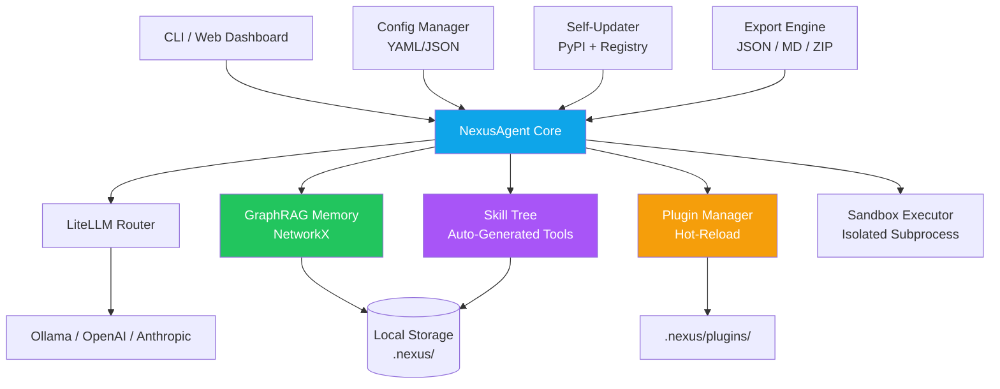

<p align="center">
  

  <h1 align="center">⚡ NexusAgent</h1>
  <p align="center">
    <strong>The Zero-Config, Self-Evolving Local AI Agent Framework</strong>
  </p>
  <p align="center">
    <em>Privacy-first · GraphRAG memory · Skill auto-generation · Plugin ecosystem</em>
  </p>
</p>

<p align="center">
  <a href="https://github.com/rudra496/nexus-agent/releases"></a>
  <a href="https://pypi.org/project/nexus-agent/"></a>
  <a href="https://github.com/rudra496/nexus-agent/stargazers"></a>
  <a href="https://github.com/rudra496/nexus-agent/actions"></a>
  <a href="https://codecov.io/gh/rudra496/nexus-agent"></a>
  <a href="https://pypi.org/project/nexus-agent/"></a>
  <a href="https://github.com/rudra496/nexus-agent/blob/main/LICENSE"></a>
  <a href="https://github.com/rudra496/nexus-agent/pulls"></a>
  <a href="https://github.com/rudra496/nexus-agent/issues"></a>
</p>

<p align="center">
  <a href="#installation"><b>Install</b></a> ·
  <a href="#quick-start"><b>Quick Start</b></a> ·
  <a href="#features"><b>Features</b></a> ·
  <a href="#cli-reference"><b>CLI</b></a> ·
  <a href="https://rudra496.github.io/nexus-agent"><b>Website</b></a> ·
  <a href="docs/configuration.md"><b>Config</b></a> ·
  <a href="docs/plugin-guide.md"><b>Plugins</b></a>
</p>

---

## ✨ Features

- 🧠 **GraphRAG Memory** — Persistent knowledge graph using NetworkX for intelligent context retrieval
- 🔧 **Auto Skill Generation** — Agent writes its own tools during runtime and saves them permanently
- 🔌 **Plugin System** — Extend with custom plugins, hot-reload support, hook-based architecture
- 🐳 **Docker Ready** — Full containerization with Docker and docker-compose support
- 🌐 **Web Dashboard** — Optional FastAPI dashboard for monitoring skills, memory, and task history
- 🔒 **Privacy-First** — Local-first execution with Ollama. Optional cloud models via LiteLLM.
- ⚡ **Zero Config** — Works out of the box with Ollama; configurable when you need it
- 📦 **Sandboxed Execution** — Isolated skill execution with timeouts and memory limits
- 🚀 **Self-Updating** — Check for new versions, auto-update skills from a registry
- 💾 **Export System** — Export skills, graphs, and reports as JSON, Markdown, or skill packs
- 🎯 **Multi-Model** — Works with any model via LiteLLM (Ollama, OpenAI, Anthropic, etc.)

## 🏗 Architecture



## 📦 Installation

### pip (Recommended)
```bash
pip install nexus-agent
```

### pipx (Isolated)
```bash
pipx install nexus-agent
```

### Conda
```bash
conda install -c conda-forge nexus-agent
```

### Docker
```bash
docker pull rudra496/nexus-agent
docker run -it -v $(pwd):/workspace rudra496/nexus-agent run "Explain quantum computing"
```

### From Source
```bash
git clone https://github.com/rudra496/nexus-agent.git
cd nexus-agent
pip install -e .
```

## 🚀 Quick Start

```bash
# 1. Start Ollama (if using local models)
ollama serve

# 2. Pull a model
ollama pull llama3

# 3. Run your first task
nexus run "Create a Python function to calculate Fibonacci numbers"

# 4. Check status
nexus status

# 5. Trigger self-evolution
nexus evolve

# 6. View generated skills
nexus skills
```

## 📋 CLI Reference

| Command | Description |
|---------|-------------|
| `nexus run "prompt"` | Execute a task with the AI agent |
| `nexus evolve` | Scan workspace and build GraphRAG memory |
| `nexus status` | View memory, skills, and plugin diagnostics |
| `nexus skills` | List all auto-generated skills |
| `nexus config show` | Display current configuration |
| `nexus config set model.default ollama/codellama` | Set a config value |
| `nexus config reset` | Reset config to defaults |
| `nexus web` | Launch the web dashboard (port 8420) |
| `nexus export -f json -k skills` | Export skills as JSON |
| `nexus export -f markdown -k report` | Export full report |
| `nexus export -f skillpack` | Export shareable skill pack |
| `nexus plugin list` | List installed plugins |
| `nexus plugin reload` | Hot-reload plugins |
| `nexus update` | Check for updates and self-update |
| `nexus sync push` | Push local data to encrypted cloud sync |
| `nexus sync pull` | Pull data from cloud sync target |
| `nexus sync status` | Show cloud sync status |
| `nexus audit log` | View audit log entries |
| `nexus audit stats` | Show audit log statistics |
| `nexus marketplace search "query"` | Search marketplace for skills |
| `nexus marketplace install <name>` | Install a skill from marketplace |
| `nexus marketplace list` | List all available marketplace skills |
| `nexus benchmark run` | Run all performance benchmarks |
| `nexus benchmark compare <f1> <f2>` | Compare two benchmark files |
| `nexus mobile` | Start mobile companion API server |

## ⚙ Configuration

NexusAgent uses a YAML config file at `~/.nexus/config.yaml` (auto-created on first run).

```yaml
model:
  default: "ollama/llama3"
  fallback: null
  max_tokens: 2048
  temperature: 0.7

memory:
  max_nodes: 10000
  max_edges: 50000
  persistence_file: ".nexus/memory/graph.pkl"

skills:
  directory: ".nexus/skills"
  auto_evolve: true
  sandbox_enabled: true
  timeout_seconds: 30

plugins:
  directory: ".nexus/plugins"
  hot_reload: true

web:
  enabled: false
  host: "127.0.0.1"
  port: 8420
```

See [docs/configuration.md](docs/configuration.md) for the full reference.

## 🔌 Plugin System

Extend NexusAgent with custom plugins. Drop a `.py` file in `.nexus/plugins/`:

```python
# .nexus/plugins/my_plugin.py

def nexus_pre_execute(prompt: str) -> str:
    """Hook called before agent execution."""
    print(f"[MyPlugin] Processing: {prompt[:50]}...")
    return prompt

def nexus_post_execute(response: str) -> str:
    """Hook called after agent execution."""
    return response.upper()  # Example transform
```

```bash
nexus plugin list    # See loaded plugins
nexus plugin reload  # Hot-reload changed plugins
```

See [docs/plugin-guide.md](docs/plugin-guide.md) for the full plugin development guide.

## 📖 API Reference

```python
from nexus.agent import NexusAgent
from nexus.config import load_config, save_config
from nexus.plugins import PluginManager
from nexus.export import export_skills_json, export_markdown_report
from nexus.sandbox import Sandbox

# Create agent with custom model
agent = NexusAgent(model="ollama/codellama")

# Execute a task
response = agent.execute("Write a sorting algorithm")

# Evolve (scan workspace)
stats = agent.evolve()

# Export data
export_skills_json(agent, "skills.json")
export_markdown_report(agent, "report.md")

# Sandbox execution
sandbox = Sandbox(timeout=30, max_memory_mb=256)
result = sandbox.execute("print('Hello from sandbox!')")
```

See [docs/api-reference.md](docs/api-reference.md) for complete API docs.

## 🔐 Enterprise

NexusAgent includes enterprise-grade features for team deployments:

- **Audit Logging** — Structured JSON-lines audit log tracking all agent actions with log rotation
- **RBAC** — Role-based access control with admin, user, and viewer roles
- **Encrypted Sync** — Fernet symmetric encryption for all synced data
- **CLI:** `nexus audit log`, `nexus audit stats`, `nexus sync push/pull/status`

## 🏪 Marketplace

Discover and install community-built skills from the built-in marketplace:

```bash
nexus marketplace list                    # Browse all skills
nexus marketplace search "docker"         # Search by keyword
nexus marketplace install docker_builder   # Install a skill
```

Categories: code-quality, data-processing, devops, research, web, security.

## 📊 Comparison

| Feature | NexusAgent | Aider | Continue.dev | Cursor | OpenHands |
|---------|-----------|-------|-------------|--------|-----------|
| **Runs Locally (with Ollama)** | ✅ | ✅ | ✅ | ❌ | ❌ |
| **GraphRAG Memory** | ✅ | ❌ | ❌ | ❌ | ❌ |
| **Self-Evolving Skills** | ✅ | ❌ | ❌ | ❌ | ❌ |
| **Plugin System** | ✅ | ❌ | ✅ | ✅ | ✅ |
| **Web Dashboard** | ✅ | ❌ | ❌ | ✅ | ✅ |
| **Zero-Config Setup** | ✅ | ⚠️ | ⚠️ | ✅ | ⚠️ |
| **Sandboxed Execution** | ✅ | ❌ | ❌ | ❌ | ✅ |
| **CLI Interface** | ✅ | ✅ | ❌ | ❌ | ❌ |
| **Open Source (MIT)** | ✅ | ✅ | ✅ (Apache) | ❌ | ✅ |

> ⚠️ = Requires some configuration. This comparison reflects publicly available documentation as of April 2026 and is provided in good faith — please verify for your specific use case.

## 🗺 Roadmap

See [docs/roadmap.md](docs/roadmap.md) for the full roadmap.

### ✅ v0.1 — Core Agent
- [x] GraphRAG memory with NetworkX
- [x] Auto skill generation
- [x] Basic CLI (`run`, `evolve`, `status`, `skills`)
- [x] LiteLLM multi-model support + Ollama

### ✅ v0.2 — Plugins & Dashboard
- [x] Configuration management (YAML/JSON)
- [x] Plugin system with hot-reload
- [x] Web dashboard (FastAPI + REST API)
- [x] Sandboxed execution (timeout, memory limits)
- [x] Export system (JSON, Markdown, ZIP skill packs)
- [x] Self-updater + skill registry
- [x] Docker support
- [x] CI/CD + 40+ tests

### ✅ v0.3 — Multi-Agent
- [x] Multi-agent orchestration engine
- [x] Task delegation and intelligent routing
- [x] Collaborative shared memory
- [x] Agent communication protocol (broadcast + direct messaging)
- [x] Agent roles (coder, reviewer, tester, planner, researcher)
- [x] Priority-based task queue with load balancing

### ✅ v0.4 — Voice & IDE
- [x] Voice interface (Whisper STT + pyttsx3/edge-tts TTS)
- [x] IDE integration base (JSON-RPC, VS Code manifest, JetBrains ready)
- [x] AST-aware code memory (functions, classes, imports, dependencies)
- [x] Context window management (token budgeting, priority selection)
- [x] Inline code suggestions (completion, diagnostics API)
- [x] `nexus voice` and `nexus analyze` CLI commands
- [x] 90+ total tests

### ✅ v1.0 — Production
- [x] Encrypted cloud sync (Fernet, local/S3/WebDAV, delta sync)
- [x] Audit logging & RBAC (JSON-lines, admin/user/viewer, log rotation)
- [x] Skill marketplace (search, install, rate, 6 categories)
- [x] Performance benchmark suite (4 benchmarks, compare runs)
- [x] Mobile companion API (REST + JWT, mobile web UI)
- [x] New CLI commands: `sync`, `audit`, `marketplace`, `benchmark`, `mobile`
- [x] 140+ tests, 50 GitHub topics

## 🤝 Contributing

Contributions are welcome! Please see [CONTRIBUTING.md](CONTRIBUTING.md) for guidelines.

1. Fork the repository
2. Create your feature branch (`git checkout -b feature/amazing`)
3. Commit your changes (`git commit -m 'Add amazing feature'`)
4. Push to the branch (`git push origin feature/amazing`)
5. Open a Pull Request

Please read our [Code of Conduct](CODE_OF_CONDUCT.md) and [Security Policy](SECURITY.md).

## ⚡ Performance

NexusAgent is designed for minimal overhead. Key performance characteristics:

| Component | Design Target | Notes |
|-----------|--------------|-------|
| Startup | Near-instant | Only loads config + existing skills |
| Graph Retrieval | Proportional to graph size | Keyword-based lookup over NetworkX |
| Skill Execution | Bounded by sandbox timeout | Configurable, default 30s |
| Plugin Load | On-demand | Loaded once, hot-reloaded on change |

> Run `nexus benchmark run` to measure actual performance on your hardware. Use `nexus benchmark compare` to track regressions across versions.

## 📄 License

This project is licensed under the MIT License — see the [LICENSE](LICENSE) file for details.

## 🙏 Acknowledgments

- [LiteLLM](https://github.com/BerriAI/litellm) — Unified LLM API
- [NetworkX](https://networkx.org/) — GraphRAG memory backbone
- [Rich](https://rich.readthedocs.io/) — Beautiful CLI output
- [Typer](https://typer.tiangolo.com/) — CLI framework
- [FastAPI](https://fastapi.tiangolo.com/) — Web dashboard framework
- [Ollama](https://ollama.ai/) — Local LLM runtime

## 💖 Sponsor

If you find NexusAgent useful, consider supporting its development:

<a href="https://github.com/sponsors/rudra496"></a>
<a href="https://ko-fi.com/rudra496"></a>

## 👤 Author

**Rudra Sarker**

<a href="https://github.com/rudra496"></a>
<a href="https://www.linkedin.com/in/rudrasarker"></a>
<a href="https://x.com/Rudra496"></a>
<a href="https://rudra496.github.io/site"></a>
<a href="https://dev.to/rudra_sarker"></a>
<a href="https://www.youtube.com/@rudrasarker9732"></a>
<a href="https://www.instagram.com/rudrasarker/"></a>
<a href="https://www.researchgate.net/profile/Rudra-Sarker-3"></a>
<a href="https://www.facebook.com/rudrasarker130"></a>
<a href="mailto:rudrasarker130@gmail.com"></a>

---

<p align="center">
  <sub>Built with ⚡ by <a href="https://github.com/rudra496">Rudra Sarker</a></sub>
</p>
